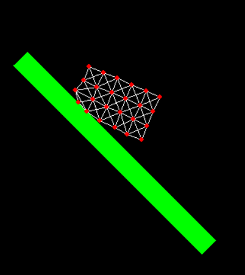

# Soft-Body simulation with pygame

## Spring/mass model

Simuleringen er en fjær/masse modell. Den fungerer ved at legemet er en samling av massepunkt (noder), som er koblet sammen med fjærer (kanter). Hver fjær har en hvilelengde $l$, og en fjærkonstant $k$. $x$ er hvor forskjellen i faktisk lengde og hvilelengden til fjæren. Kraften til fjærene kan da regnes ut med hjelp av Hooke's lov.

$$F = kx$$

Litt omskrivning, og man ender opp med et utrykk for hvor mye fjærene påvirker akselerasjonen til massepunktene.

$$a = \frac{kx}{m}$$

Deretter legger man til en konstant gravitasjonskraft, og man ender opp med et fullstendig utrykk for akselerasjon. Siden akselerasjonen vil endre seg med tiden kan man bruke Eulers metode med små tidsintervall for å kjøre gjennom simuleringen. Man har da laget et program som kan simulere en simpel versjon av soft-body dynamics.
